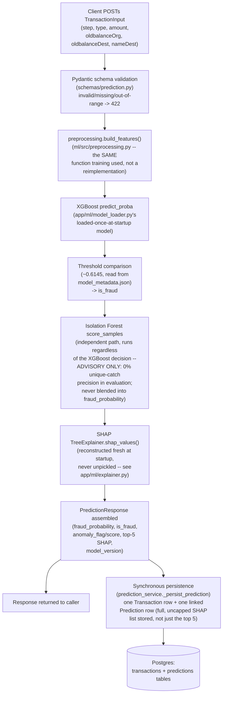

# Architecture

A map of how this system fits together: how it runs, how a transaction actually flows through it,
and where each piece of code lives. This is the mental model, not the full decision log behind
every choice.

## Why a modular monolith, not microservices

This is a single deployable FastAPI service, organized internally into clear modules
(`api/`/`core`/`db`/`schemas`/`ml`/`features`/`services`) talking to one Postgres database. No
service mesh, no message queue, no separate inference service. I built it this way because of what
this project actually is: a **portfolio project** meant to show breadth and depth of engineering
understanding to an internship reviewer, not a system that needs to survive production scale or
traffic. A modular monolith keeps the whole thing easy to reason about, easy to run locally with no
orchestration, and easy to explain end to end in an interview. Splitting it into services would add
real operational complexity (network calls, partial failure, deployment coordination) without
buying anything this project's actual scale needs.

## How this system runs: three separate paths

These are three genuinely independent ways to run the same codebase. They aren't layered on top of
each other, and a given run only ever uses one of them.

```mermaid
flowchart TB
    subgraph local["Path 1: Local dev (the actual day-to-day loop)"]
        direction LR
        L1["uvicorn --reload\n(backend/, host process)"]
        L2["npm run dev\n(frontend/, host process)"]
        L3["Local or hosted Postgres"]
        L2 -->|HTTP :8000| L1
        L1 -->|SQLAlchemy| L3
    end

    subgraph compose["Path 2: Docker Compose (local convenience + containerization practice)"]
        direction LR
        C1["backend container\n(backend/Dockerfile)"]
        C2["frontend container\n(frontend/Dockerfile,\nNext standalone output)"]
        C3["postgres container\n(postgres:16, named volume)"]
        C2 -->|host-mapped\nlocalhost:8000\nsee note below| C1
        C1 -->|service DNS\npostgres:5432| C3
    end

    subgraph live["Path 3: Live public deployment"]
        direction LR
        V["Vercel\n(Next.js frontend,\nGit-connected build)"]
        R["Render\n(FastAPI backend,\nplain git checkout,\nno Docker)"]
        S["Supabase Postgres\n(Transaction pooler\nfor app runtime,\nSession pooler\nfor migrations)"]
        V -->|HTTPS| R
        R -->|SQLAlchemy| S
    end
```



- **Path 1 (local dev)** is how I actually built this whole project: `uvicorn --reload` and
  `npm run dev` running directly on the host, against a local (or free-tier-hosted) Postgres
  instance. No Docker anywhere in this path.
- **Path 2 (Docker Compose)** exists purely as a packaging and containerization exercise. I never
  used it during this project's real development, and it has no connection to Path 3 in either
  direction. One real gotcha baked into this path: the frontend container's `NEXT_PUBLIC_API_URL`
  gets inlined into the client JS bundle at `next build` time, and every page that calls the
  backend runs client-side in the visitor's *browser*. That means the URL has to be the backend's
  host-mapped address (`http://localhost:8000`), not Compose's internal service DNS
  (`http://backend:8000`), even though the latter looks like the "obviously correct" answer.
  Migrations here are a deliberate manual step (`docker compose exec backend alembic upgrade
  head`), not an auto-run entrypoint. That choice came from a real migration-lag incident on this
  project's live deployment, where a schema change shipped without a corresponding manual migration
  run and silently broke production reads and writes until I caught and fixed it.
- **Path 3 (live deployment)** is the actual public demo: Vercel builds the frontend directly from
  its Git-connected pipeline, Render runs the backend from a plain `git clone` plus `pip install`
  (no Docker involved at all), and both talk to a real Supabase Postgres instance. The app-runtime
  connection goes through Supabase's Transaction pooler, while Alembic migrations use the Session
  pooler instead, since a transaction-mode pooler can hand different backend connections to
  different statements within one migration, which doesn't play well with DDL.

## Request data flow: `POST /predict`

The core real-time path: a transaction gets scored *before* it executes, using only fields that
would actually be available at that point in time. That constraint is what decides which fields
exist in the schema at all.



Notes that matter for reading this diagram correctly:

- **Isolation Forest is fully independent of the XGBoost decision.** It runs on every request
  regardless of what XGBoost decided, and `anomaly_flag`/`anomaly_score` are surfaced as their own
  fields, never merged into `fraud_probability`/`is_fraud`. I measured this directly: Isolation
  Forest added zero unique true-positive catches on this dataset, so it's kept as a secondary,
  clearly-labeled signal rather than a second vote.
- **Persistence is synchronous, in the request path, not a background task.** A DB failure here is
  caught and logged, but the caller still gets their (already-computed, already-valid)
  `PredictionResponse`. A storage hiccup shouldn't turn a working prediction into a 500.
- The simulator (`/simulator/*`) and the Stripe webhook (below) both call `predict_transaction()`
  directly, in-process, never a second HTTP round-trip back into this same app.

## Stripe webhook path: a second entry point into the same scoring core

`POST /webhooks/stripe` gates a real (test-mode) Stripe payment using the identical scoring
function `/predict` uses, adapted from Stripe's schema to this model's PaySim-shaped input.

```mermaid
flowchart TD
    A["Stripe fires payment_intent.created\n(at PaymentIntent CREATION time,\nnot confirm/succeeded --\nscoring must happen before\nthe payment can be stopped)"]
    B["POST /webhooks/stripe receives event"]
    C["Signature verification\n(stripe.Webhook.construct_event\nagainst the RAW body + webhook secret)\nmandatory -- bad/missing signature -> 400,\nnothing scored or persisted"]
    D["stripe_adapter.py maps the\nPaymentIntent -> TransactionInput\n(documented simplifications:\nsynthetic wallet balance in Customer\nmetadata as oldbalanceOrg, fixed\noldbalanceDest/type/is_merchant_dest,\ncents->dollars, epoch-derived step --\nsee stripe_adapter.py's own docstring\nfor the full reasoning, not repeated here)"]
    E["predict_transaction()\n(the SAME function POST /predict calls --\nan in-process call, never a loopback\nHTTP request back into this app)"]
    F{"is_fraud?"}
    G["stripe.PaymentIntent.cancel(...)\na real Stripe API call --\nprevents this PaymentIntent from\never being confirmed"]
    H["No action -- payment proceeds\nto confirmation normally"]
    I["Persistence: one Transaction +\none Prediction row,\nsource = \"stripe_test\"\n(distinguishes this path from\nsource = \"paysim_sim\")"]
    J["200 returned to Stripe\n(always 200 on ML outage too --\na deliberate divergence from\n/predict's 503, since Stripe\nretry-storms any non-2xx)"]

    A --> B --> C --> D --> E --> F
    F -->|yes| G --> I
    F -->|no| H --> I
    I --> J
```

## Component map

### Backend (`backend/app/`)

| Module | What lives there |
|---|---|
| `api/` | Thin route handlers, no business logic: `predict.py`, `predictions.py` (read/list), `health.py`, `simulator.py`, `stripe_webhooks.py`, `stripe_checkout.py`. |
| `core/` | `config.py` (`pydantic-settings` `Settings`, repo-root resolution, the `ml/src` `sys.path` insert), `limiter.py` (shared `slowapi` rate limiter instance). |
| `db/` | `models.py` (SQLAlchemy `Transaction`/`Prediction` models), `session.py` (engine/session setup, pooled vs. direct URL handling), Alembic migrations (`alembic/versions/`). |
| `ml/` | The model-loading layer: `model_loader.py`, `explainer.py`, `isolation_forest_loader.py`. Loads artifacts **once at startup** onto `app.state`, fails loudly if anything is missing, never reloads per-request. |
| `schemas/` | Pydantic request/response shapes: `prediction.py` (`TransactionInput`/`PredictionResponse`/list & detail shapes), `simulator.py`, `stripe_checkout.py`. |
| `services/` | Business logic orchestrating db/ml/features: `prediction_service.py` (the core scoring+persistence pipeline described above), `prediction_read_service.py`, `simulator.py` (the background transaction generator), `stripe_adapter.py` (maps Stripe data to `TransactionInput`). |

### Frontend (`frontend/app/`)

| Page | What it does |
|---|---|
| `/` (Overview) | All-time stat tiles plus a live-polling recent-activity feed off `GET /predictions`, filterable by fraud/anomaly status. |
| `/transactions` | The full paginated history behind Overview's feed: real `limit`/`offset` pagination, same filters. |
| `/transactions/[id]` | Transaction + Prediction detail cards and the full uncapped SHAP bar chart for one scored row. |
| `/test-transaction` | A live form that calls `POST /predict` directly: manual input or legit/fraud presets, with a probability gauge and SHAP chart. |
| `/simulator` | Start/stop controls, a rate slider, and scenario-mix sliders (legit/fraud/velocity) for the background `TransactionSimulator`. |
| `/checkout` | A real Stripe Elements checkout flow (test-mode) that exercises the webhook-gating path above end to end in a browser. |

All data fetching goes through `lib/api.ts` (a typed client kept in sync with the backend's
Pydantic schemas) via `lib/hooks.ts`'s TanStack Query hooks. No component calls the API client
directly. There are no WebSockets/SSE anywhere: every "live" surface polls on a shared
`POLL_INTERVAL_MS` interval.

### `ml/` directory

| Directory | What lives there |
|---|---|
| `notebooks/` | Exploratory analysis and the modeling notebooks (EDA, baseline, Random Forest, XGBoost, model comparison, SHAP, Isolation Forest), each paired with a `*_FINDINGS.md` write-up. |
| `src/` | Reusable, importable training/serving code: `preprocessing.py` (`build_features()`, shared verbatim between training and the backend's real-time scoring), `split.py` (the time-based train/test split), `download_data.py`, `data_prep.py`, `serialize_isolation_forest.py`. |
| `models/` | Serialized trained artifacts (`xgboost_model.pkl`, `model_metadata.json`, `isolation_forest.pkl`), gitignored everywhere except the three files the live deploy actually needs, which are committed so Render's git-based deploy has something to load. |
