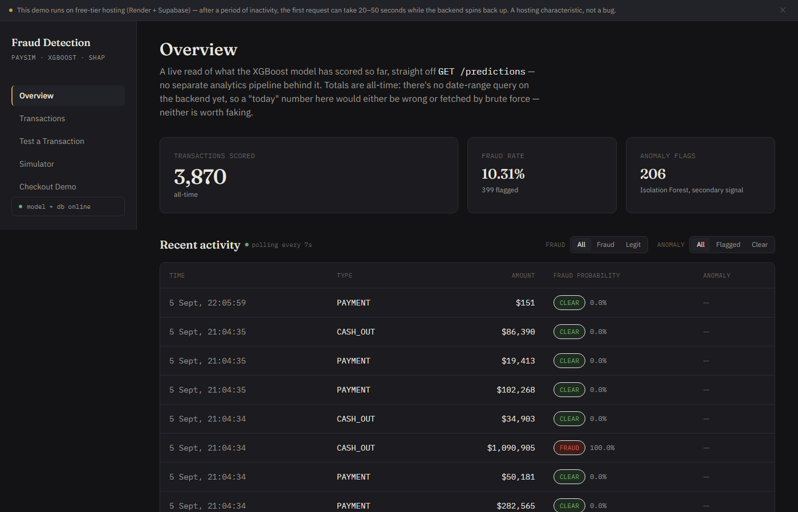
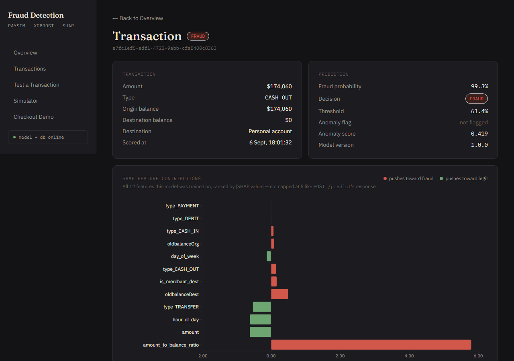
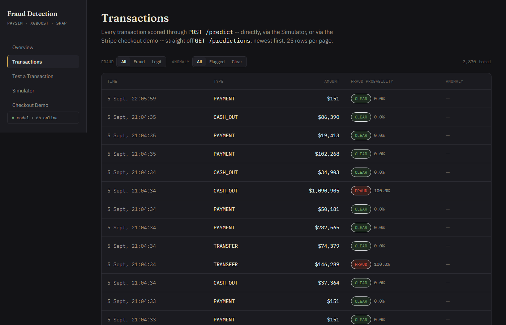
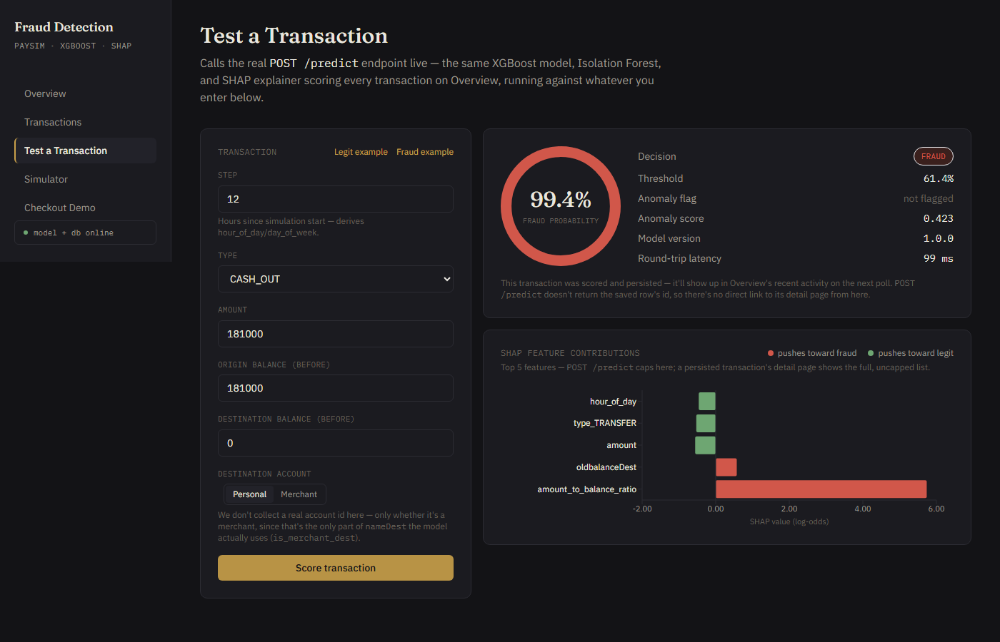
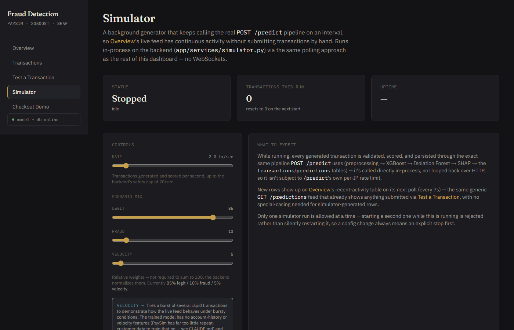
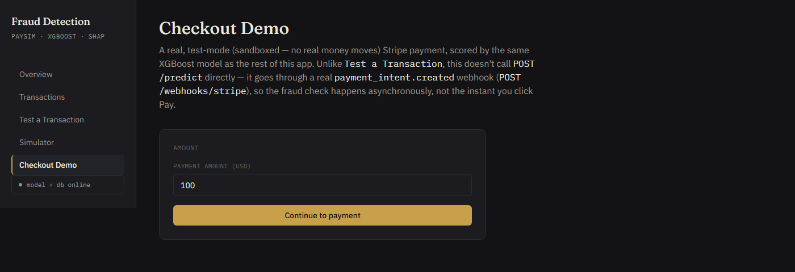

# Fraud Detection Platform

I built this real-time fraud detection platform on Kaggle's PaySim dataset. Every transaction is
scored the instant it arrives by an XGBoost classifier, explained per-decision with SHAP, and
cross-checked against an Isolation Forest anomaly signal, end to end: a FastAPI/Postgres backend, a
live Next.js dashboard, and a real (test-mode) Stripe payment integration gated by the model in
real time. It's a **portfolio project** demonstrating ML, backend, and frontend engineering
together, not a production fraud system, so I made decisions throughout to demonstrate real
engineering practice (time-based train/test splits, leakage-aware feature design, model
explainability, an honest accounting of the dataset's limits) rather than to handle real-world
scale.

See **[ARCHITECTURE.md](./ARCHITECTURE.md)** for a system diagram and how the pieces fit together.

## Live Demo

**Frontend:** [fraud-detection-six-nu.vercel.app](https://fraud-detection-six-nu.vercel.app)
**Backend API:** [fraud-detection-api-blkr.onrender.com](https://fraud-detection-api-blkr.onrender.com) (interactive docs at `/docs`)

> **Heads up:** I run this on free-tier hosting (Render + Supabase). A scheduled keep-alive ping
> (confirmed firing on its own schedule, not just manually) usually keeps it warm, but an
> occasional first visit can still take up to a couple of minutes while the backend spins back up.
> That's a hosting characteristic, not a bug (a real overnight-idle test measured a cold start
> directly at roughly 95–105 seconds with the keep-alive deliberately disabled). The site itself
> explains this if you hit it (a dismissible banner, and a "waking up the backend…" status in place
> of a blank screen on any request that's taking a while).

See **[CASE_STUDY.md](./CASE_STUDY.md)** for a focused write-up of this project's key technical
decisions and results.

See **[docs/API.md](./docs/API.md)** for the full endpoint reference, or explore it live at the
[Swagger UI](https://fraud-detection-api-blkr.onrender.com/docs).

## Feature Walkthrough

### Overview

The landing page: all-time stat tiles (transactions scored, fraud rate, anomaly flags) and a
live-polling feed of the most recent predictions, filterable by fraud/anomaly status. Every row
links through to a full SHAP breakdown for that transaction.

### Transactions

The full history behind Overview's feed, off the same `GET /predictions` endpoint, with real
Previous/Next pagination (25 rows/page) instead of a fixed recent slice, and the same fraud/anomaly
filters.

### Test a Transaction

A live form that calls `POST /predict` directly. Enter a transaction by hand (or load a preset
legit/fraud example) and see the real fraud probability, decision, anomaly score, and a SHAP
waterfall chart explaining exactly which features pushed the score toward fraud or legitimate.

### Simulator

A background transaction generator that continuously calls the same scoring pipeline as Test a
Transaction, so the dashboard has a live feed of activity without submitting transactions by hand.
Rate and the legit/fraud/velocity scenario mix are both adjustable from the page.

### Checkout Demo

A real (test-mode, sandboxed, no real money moves) Stripe payment flow: creating a PaymentIntent
fires a real Stripe webhook that scores the payment through this project's model in real time and
can cancel it before it's ever confirmed. It's the model gating a live payment rail, not just an
isolated ML demo running on the side.

## Tech Stack

- **Backend:** FastAPI, SQLAlchemy, Alembic, PostgreSQL (Supabase in production)
- **ML:** scikit-learn, XGBoost, SHAP, imbalanced-learn, trained on Kaggle's PaySim synthetic
  fraud dataset
- **Frontend:** Next.js 14 (App Router), TypeScript, Tailwind CSS, TanStack Query, Recharts
- **Payments:** Stripe (test mode)
- **Deployment:** Render (backend), Vercel (frontend), Supabase (Postgres), GitHub Actions
  (scheduled keep-alive ping)

## Running Locally

Two ways to run this, for two different purposes:

**1. Daily dev (recommended):** `uvicorn --reload` + `npm run dev` + a local Postgres. This is how I
built and tested the whole project: fastest iteration, live reload on both backend and frontend,
and no rebuild step between a code change and seeing it run. Full command-by-command setup is in
[SETUP.md](./SETUP.md).

**2. Full-stack Docker Compose:** `docker compose up -d --build`, then
`docker compose exec backend alembic upgrade head` once to create the schema. This runs the whole
stack (Postgres + FastAPI + Next.js) as three built containers with a single command, useful as a
self-contained local setup and as practice containerizing a multi-service app for a portfolio. I
**didn't** use it during actual development of this project (that was always path 1 above), and it
has **no connection to the live deployment** above (Render/Vercel/Supabase build and run
independently of Docker entirely). I verified it works end to end from a clean state: all three
containers build and pass their healthchecks, migrations apply cleanly against the container's own
Postgres, and a transaction submitted through the containerized frontend is scored by the
containerized backend and persisted to the containerized database. Full instructions, including the
(small, Supabase-free) env var setup, are in SETUP.md's "Docker Compose (full stack)" section.

## Known Limitations

I pulled these from this project's own decision log rather than reinventing them here:

- **Synthetic data, not real transactions.** The model is trained entirely on PaySim, a simulated
  dataset. I chose it specifically because its fields are interpretable (real amounts and balances,
  not PCA-anonymized columns), which is what makes the SHAP explainability story possible, but it
  isn't real-world transaction data.
- **The model has never seen fraud outside two transaction types.** PaySim's fraud only occurs in
  `TRANSFER` and `CASH_OUT`. There are zero fraud examples for `PAYMENT`, `CASH_IN`, or `DEBIT` to
  train on.
- **No account-history or velocity features.** PaySim has too little repeat-customer activity
  (0.15% of origin accounts recur) to train real behavioral features on. The Simulator's
  "velocity" scenario is a UI illustration of a rapid-fire transaction burst, not a claim that the
  model detects velocity-based fraud. Every transaction in a burst is scored completely
  independently.
- **The fraud threshold (~0.6145) is a reasoned demo choice, not cost-calibrated.** It maximizes
  precision at ≥99% recall on the evaluation set, a defensible default given there's no real
  fraud/false-positive cost data behind a synthetic dataset, not a number derived from actual
  business economics.
- **Isolation Forest is a secondary, non-blocking signal.** In evaluation it added zero unique
  fraud catches beyond XGBoost on this dataset (PaySim's fraud only has one generation pattern), so
  I surface it as a separate "anomaly" flag and never blend it into the fraud decision.

Local development setup (Python/Node environments, database, Stripe test keys) is covered in
[SETUP.md](./SETUP.md).
